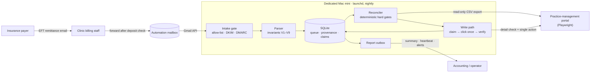

# Remittance Reconciler

Production payment-reconciliation automation that matches insurance EFT remittance records against clinic invoices, validates every financial write before and after it happens, routes anything ambiguous to a person, and produces auditable daily reports — unattended.

> This is a de-identified public version of a system deployed for a multi-location healthcare clinic. Names, identifiers, amounts, dates, URLs, UI labels and fixtures in this repository are synthetic, and portal selectors are generic placeholders. See [Privacy](#privacy).

This repository is a sanitized snapshot of a separately developed production system; production Git history is intentionally not published to avoid exposing confidential operational information.

---

## Problem

The clinic receives electronic funds transfer (EFT) remittance notices from an insurance payer by email. Each notice lists the invoices being paid, often dozens of rows per statement. Before this project, billing staff reconciled every row by hand:

1. find the invoice in the clinic's practice-management portal,
2. confirm that the amount and the payer match,
3. check that it was not already paid,
4. post the payment against the invoice.

The work is repetitive, and mistakes are financial: posting against the wrong invoice or posting twice corrupts accounts receivable, while a missed row leaves revenue unrecorded. The portal offers no API for this workflow, so automation has to drive its web interface.

## Solution

Every night the system:

1. **Ingests** remittance emails through the Gmail API, accepting only messages forwarded by allow-listed clinic staff whose mail domain passes DKIM and DMARC.
2. **Parses** each email's HTML table into a validated statement: exact `Decimal` arithmetic, structural invariants, and *deposit = footer total = sum of rows*.
3. **Persists** statements and rows in SQLite with immutable provenance. The database, not the mailbox, drives the work queue.
4. **Reconciles** every row against the portal's sales-report export using deterministic hard gates: identifier match (suffix-preserving), exact amount, expected payer, positive net.
5. **Re-validates** each approvable invoice on its live detail page immediately before writing.
6. **Posts** the payment through the portal UI exactly once, behind a durable write claim, and confirms success from server-persisted state.
7. **Reports** a completion summary, an idle-day heartbeat, or a failure / login-required alert. Every processing run enqueues exactly one report; early exits (lock held, outside the start window) are written to an incident log.

Anything that fails a check is left untouched and listed for a person with a reason code. *Automating less* is an acceptable outcome; *writing the wrong thing* is not.

### What I built

I designed and implemented the system end to end:

- the safety model (named guards and parser invariants) and the row and statement state machines;
- Gmail intake with a sender-authentication trust gate, the remittance parser and the reconciliation rules;
- the Playwright portal adapter and the single irreversible write primitive;
- the SQLite schema, append-only claim journal, reporting and operator recovery tools;
- a 732-case test suite and the unattended macOS deployment.

## Architecture



The run is a fixed sequence of stages: start-window check, exclusive lock, intake, DB-driven queue, portal authentication, then per statement **reconcile → detail validation → guarded writes → finalize**, and finally one report. Details: [docs/ARCHITECTURE.md](docs/ARCHITECTURE.md).

## Key engineering challenges

**Reconciliation correctness.** Money is `Decimal` end to end; the amount parser preserves sign across three negative notations and rejects anything that is not exactly two decimals. The parser binds columns by name, requires every header field exactly once and cross-checks deposit, footer and row sum. Invoice identifiers keep their `-B01`/`-B02` suffix because each suffix is a different invoice; comparisons fold case but never touch the suffix.

**Safe financial writes.** The portal is never a source of authority: a row can be written only if it descends from a trusted email → parsed statement → immutable parsed row. The write path re-reads the invoice, resolves the single exact action, commits a claim (fsync'd journal first, then the database), clicks once, and accepts success only from persisted server state that survives a re-fetch.

**Browser automation reliability.** UI targeting is semantic and scoped: find the trigger by the menu it controls, confirm the menu is open via `aria-expanded`, then require exactly one exact `menuitem` inside that container. The write action never relies on coordinates, positional selectors, keyboard selection or partial text. The session lives in a persistent profile; login happens at most once from the Keychain; any visible CAPTCHA or MFA challenge stops the run with a distinct `LOGIN_REQUIRED` outcome.

**Idempotency.** Message ids, a unique `(vendor_no, payment_document_no)` key, a SHA-256 content fingerprint and a case-insensitive, never-deleted claim ledger make every stage safe to re-run. A resend with different content for the same key quarantines the new email and halts the unfinished original.

**Exception handling.** Uncertainty always resolves to "no click": malformed rows are isolated, unknown vendors and stale statements are quarantined, mismatches become `MANUAL_REVIEW`, and a click with an unconfirmed outcome is recorded as `UNKNOWN_OUTCOME`, never retried, and halts the run.

**Auditability.** Every write claim records the source message id, payee ID, remittance number, content fingerprint and raw parsed identifier, so "which email authorized this payment?" is answerable from the database alone.

## Reliability & safety

| Safeguard | What it prevents |
|---|---|
| Durable write claim before the click; an existing claim blocks any further automated click | Double posting after crashes, retries or state changes |
| Provenance verification at write time (including deposit = sum of immutable rows) | Paying an invoice that no trusted remittance authorized |
| Fresh detail-page validation: identifier, total, unpaid status, stored portal id, exact action | Stale pages, wrong links, concurrent manual payments |
| Persisted success signal with re-fetch; ambiguous outcomes halt the run | Treating an unverified click as paid, or clicking again |
| Kill switch (`dry_run`), per-run caps, per-statement amount guard, consecutive-failure breaker | Runaway writes |
| Cutover date and statement-age guards | Re-processing historical remittances already handled by hand |
| DB-driven queue, atomic ingestion, content fingerprints | Lost or duplicated statements |
| Exclusive `flock`, start-window check, report outbox, heartbeat on idle days | Overlapping runs, business-hours surprises, silent failures |

## Tech stack

- **Python 3.13** — `decimal`, `sqlite3`, `hashlib`, `fcntl`, `email.utils`
- **Playwright** (Chromium, persistent context) for portal automation
- **Gmail API** (`google-api-python-client`, OAuth, read-only + send scopes)
- **SQLite** in WAL mode with `synchronous=FULL`
- **lxml** for HTML parsing, **PyYAML** for configuration
- **macOS**: launchd LaunchAgent, Keychain, FileVault
- **pytest**

No AI, LLM, OCR or computer vision: every decision is explicit logic over exact values.

## Testing

**732 test cases** across 20 modules (≈8.7k lines), run against fakes with no network, browser or real mailbox. A few tests invoke the macOS `security` tool and `git`, so the suite targets macOS. Coverage includes:

- decision tables for classification, terminal states, date windows and export integrity;
- parser invariants against synthetic edge-case fixtures (reordered, missing, duplicate and extra columns; credit memos; malformed identifiers; forwarded-email wrappers);
- intake security: display-name spoofing, injected authentication headers, DMARC alignment;
- write-path ordering, crash and ambiguity handling, and read-only claim recovery;
- structural tests that parse the source to prove there is exactly one write primitive, that only the database layer writes claims, and that authentication precedes every portal stage;
- operational checks: run window, claim journal durability, backup and restore drill, LaunchAgent template.

```bash
python3.13 -m venv .venv && .venv/bin/pip install -e ".[dev]"
.venv/bin/python -m pytest -q
```

One test verifies that the browser profile is git-ignored; it is skipped until the folder is a git work tree.

## Deployment

The system was deployed to production on a dedicated Mac mini and operated unattended on a nightly schedule:

- a **launchd LaunchAgent** starts it at 03:00 local time ([template](com.example.remittance-reconciler.plist)); the application refuses to *start* outside its configured window but never interrupts a run in progress;
- **portal credentials** live in the macOS Keychain and the session in a dedicated persistent browser profile; the Gmail OAuth token and the profile are owner-only;
- **distinct exit codes** separate success, failure, login required, outside window, lock held and halted;
- **outage detection** relies on the daily report itself: a heartbeat is sent even when there is nothing to process, so a missing email means the host needs attention.

Supervised tooling supports the rollout path from shadow mode (`dry_run: true`) to single-invoice live runs and unattended operation: `tools/run_smoke.py` (explicit allow-list, operator-typed exact cap, isolation diff), `tools/presmoke_check.py`, `tools/recover_claim.py` and `tools/backup_db.py`.

## Repository layout

```
src/remittance_reconciler/
  main.py         orchestration, CLI, run window, exit codes
  gmail.py        intake query and trust gate, report delivery
  parser.py       remittance HTML -> validated statement (pure)
  reconcile.py    classification and guard rules (pure)
  portal.py       Playwright adapter: auth, export, detail read, single action
  portal_csv.py   sales-report CSV parser (pure)
  provenance.py   write authorization
  writepath.py    the only code that crosses the write boundary
  database.py     SQLite schema, queue, claim ledger and journal
  report.py       summary / heartbeat / failure / login-required bodies
tests/            732 test cases and synthetic fixtures
tools/            supervised runs, pre-flight checks, recovery, backup, auth setup
docs/             architecture and design decisions
```

## Documentation

- [docs/ARCHITECTURE.md](docs/ARCHITECTURE.md): components, data flow, state machines, persistence, security boundaries, failure recovery and safety invariants.
- [docs/DESIGN_DECISIONS.md](docs/DESIGN_DECISIONS.md): the engineering decisions and trade-offs behind the design.

## Privacy

All examples and fixtures in this public repository use **synthetic, de-identified data**. The repository contains **no** patient information, employee or organization names, banking or account details, payer or vendor identifiers, real invoice, claim or payment numbers, production transaction amounts or dates, credentials, tokens, browser session state, databases, logs, reports, screenshots or recordings.

Names such as `ACME`, `SAMPLE CLINIC INC`, `portal.example.com` and `remittance@example.com` are placeholders. UI labels, routes and selector strings in the portal adapter are generic or placeholder values, not the production portal's markup. Operational files (`config.yaml`, `secrets/`, `data/`, `logs/`, `reports/`, `scratch/`, `backups/`) are excluded by `.gitignore`.
