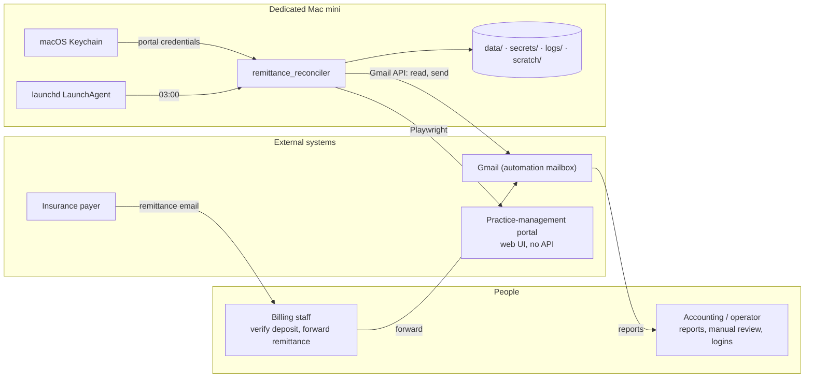
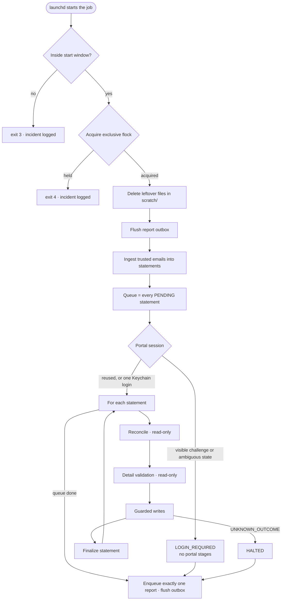
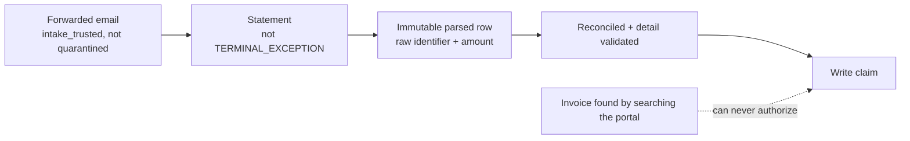
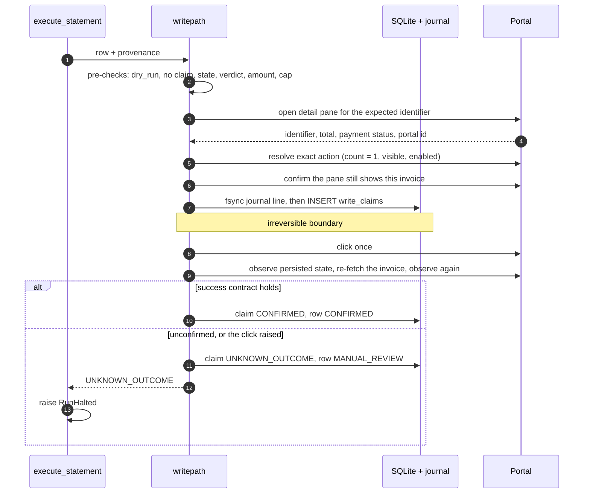
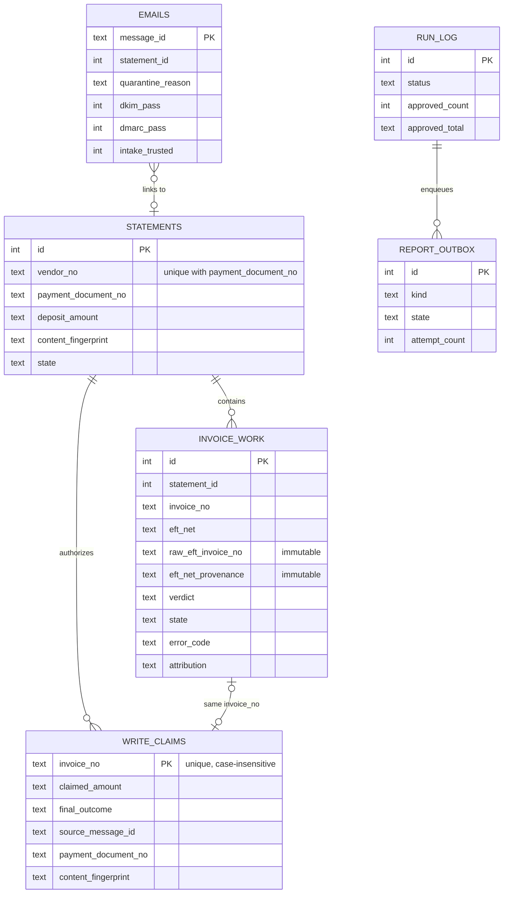
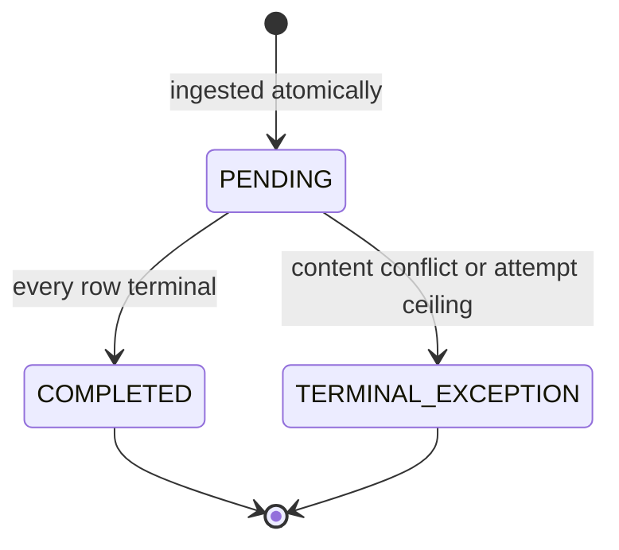
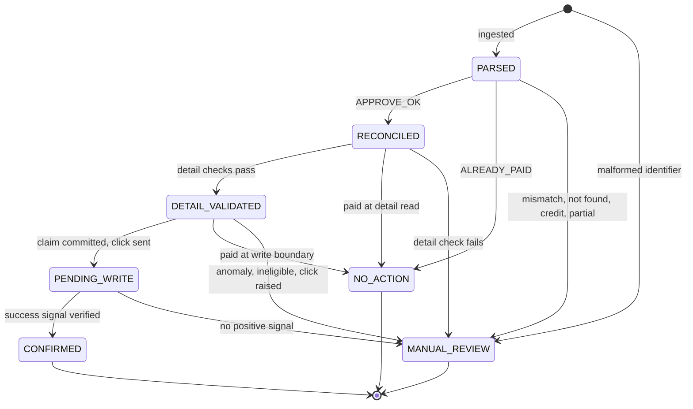

# Architecture

This document describes how the remittance reconciler works: its boundaries, the nightly run, each layer, the data model, and the invariants that keep financial writes safe. Code references point to `src/remittance_reconciler/`. Rationale for the major choices is in [DESIGN_DECISIONS.md](DESIGN_DECISIONS.md).

Guard identifiers (`G-n`) and parser invariants (`V1`–`V9`) are referenced throughout the code and tests. The invariants are listed in section 5 and the guards in section 17.

---

## 1. Business problem

A multi-location healthcare clinic is paid by an insurance payer through electronic funds transfer. For each deposit, the payer emails a remittance notice: a header (payee ID, statement date, deposit total, remittance number) and a table with one row per invoice paid.

Staff previously reconciled each row manually in the clinic's practice-management portal: locate the invoice, confirm amount and payer, confirm it is unpaid, and post the payment. The automation performs the same work unattended, under one rule:

> Any uncertainty resolves to **no write**. A row that cannot be proven correct is left for a person.

A "write" here is a bookkeeping action in the portal (posting the payer's payment against an invoice). The system never moves money between accounts, but a wrong post corrupts accounts receivable, which is why the write path is the most defended part of the design.

## 2. System boundaries

| In scope | Out of scope |
|---|---|
| Reading remittance emails from one mailbox | Any bank or payer integration |
| Parsing and validating statements | Changing payer or vendor routing |
| Reading the portal's sales report and invoice details | Editing invoices or any other portal data |
| One write action per eligible invoice: posting the payment | Deleting or reversing payments |
| Durable audit trail and email reports | Deciding exceptions (left to people) |

## 3. Run lifecycle

`main.main` is the entry point; `main.run_once` performs one run.

| Exit code | Meaning |
|---|---|
| 0 | Run completed |
| 1 | Run failed, or bootstrap error |
| 2 | Portal requires an interactive login |
| 3 | Outside the configured start window (nothing started) |
| 4 | Another run holds the lock |
| 5 | Halted after an ambiguous financial outcome |

Ordering is a safety property. The lock is taken before `scratch/` is cleaned, so a second process can never delete a live run's export file. Authentication happens before any portal stage; a structural test enforces this.

## 4. Intake layer (Gmail)

`gmail.py`, `main.ingest_messages`

**Candidate search.** A label-free Gmail query matches the remittance subject plus an `after:` date. The query only narrows candidates; it never decides trust. Messages are fetched as full `messages` (not threads).

**Trust gate** (`GmailClient._to_message`). Remittances reach the mailbox after billing staff forward them. Forwarding replaces the payer's DKIM signature, so the payer cannot be authenticated cryptographically; the gate instead proves the forward came from clinic infrastructure. In order:

1. **Sender.** The `From` header must parse (RFC 5322 parser, not a regex) to exactly one address on the configured allow-list. An empty allow-list trusts nobody.
2. **Subject.** Once forwarding prefixes (`Fwd:`, `Re:`...) are stripped, the subject must equal the expected subject.
3. **Authentication-Results.** Only the topmost header, written by the configured receiving server, is read. Headers injected lower in the message are ignored, and comments are stripped before verdicts are parsed.
4. **DKIM.** `dkim=pass` is required (configurable, on by default).
5. **DMARC.** `dmarc=pass` is required (configurable, on by default). When the receiving server records the domain DMARC evaluated (`header.from`), it must equal the sender's domain.
6. **DKIM domain (optional).** The verified signing domain must end at a label boundary with a configured suffix.
7. **HTML part.** The MIME tree is searched for a `text/html` part; plain text is never substituted.

Only a message that passes every step is marked `intake_trusted`; that flag is persisted and becomes the root of provenance.

**Ingestion** (`main.ingest_messages`), per trusted message:

- **Cutover guard (G-0).** Messages received before `automation_start_at` are skipped.
- **Seen messages.** A known message id is skipped, unless it was quarantined for a recoverable reason (V6, V9, parse crash), in which case it is re-tried.
- **Parse.** The HTML is parsed in memory. A `ParseError` or crash quarantines the message with its code.
- **Age guard (G-19).** A statement whose header date is more than `max_statement_age_days` older than receipt is quarantined.
- **Content conflict (G-22).** If the same `(vendor_no, payment_document_no)` already exists with a different fingerprint, the new email is quarantined, and an existing statement that is still PENDING moves to `TERMINAL_EXCEPTION`.
- **Atomic write.** The statement, its rows and the email link are written in one transaction.

Ingestion only adds work. Whether a statement has been processed is answered by `statements.state`, never by whether its email was seen.

## 5. Remittance parsing

`parser.py` is pure apart from logging: no file or network access, no clock, no randomness.

1. **Isolate the original message.** The forwarding attribution block is removed (its `Date:` would otherwise compete with the statement date), and parsing narrows to the quoted original.
2. **Find the table by meaning.** The first table with all required column names in one of its first rows is used, never a table by index.
3. **Bind columns by name.** Each required column must appear exactly once, in any order; extra columns add a warning.
4. **Read header fields.** Payee ID, deposit total, remittance number and statement date must each appear exactly once.
5. **Parse rows.** Rows whose cell count matches the header become statement rows; the "Total Paid" row supplies the footer total.
6. **Validate** (table below) and compute a canonical SHA-256 **content fingerprint**: header fields plus rows sorted by identifier, amounts at two decimals, control-character separators. Identical content in a different row order has the same fingerprint.

**Amounts** (`parse_amount`) are parsed without floats. Currency prefixes and thousands separators are accepted. `-1.00`, `1.00-` and `(1.00)` are all negative. Anything that is not exactly two decimals raises `ParseError("AMOUNT_FORMAT")`. The portal's CSV export uses a separate, more tolerant parser (`portal_csv.parse_portal_amount`) because its amounts often omit trailing zeros; both produce exact `Decimal` values.

| Invariant | Rule | On violation |
|---|---|---|
| V1 | Required columns present exactly once; at least one data row | Reject statement |
| V2 | Columns bound by header name, never by position | Enforced by construction |
| V2b | Extra columns | Warning |
| V3 | Row gross − previously paid − outstanding = net | Warning |
| V4 | Deposit = footer total = sum of row nets | Reject statement |
| V6 | Identifier matches `^\d+-[Bb]\d{2}$` | Row isolated (`MANUAL_REVIEW`), never repaired; reject only if every row fails |
| V7 | No duplicate identifiers (case-insensitive) | Reject statement |
| V8 | Payee ID, deposit total, remittance number and date each appear exactly once | Reject statement |
| V9 | Vendor number is in `known_vendors` | Reject; retried after config is updated |

A malformed row still counts toward V4, because its amount is valid. It can never be written.

## 6. Reconciliation logic

`main.reconcile_statement`, `reconcile.py`

1. **Export.** The portal's sales report is exported as CSV for a narrow window derived from the row dates (`reconcile.sales_report_window`), with outstanding invoices across all locations. The narrow window keeps the export small, which also limits how much patient-related data leaves the portal. The file is parsed and deleted in a `finally` block.
2. **Export integrity (G-7).** The number of parsed rows must equal the number of distinct identifiers and, in the nightly path, the settled on-screen count. The supervised path re-reads the count after exporting and accepts a drift band only when the count is observed changing. If the on-screen count cannot be read, only the duplicate check applies and a `DATE_WINDOW_DRIFT` warning is recorded. On failure, the run fails and the statement stays `PENDING`.
3. **Index (G-6).** Rows are indexed by a case-folded identifier key. A collision aborts processing.
4. **Classify** each row (`reconcile.classify`):

| Check, in order | Verdict |
|---|---|
| `net <= 0` or `gross < 0` | `CREDIT_MEMO` |
| No portal row for the identifier | `NOT_FOUND` |
| Identifier keys differ (defensive) | `MANUAL_REVIEW` |
| Payer does not start with the expected payer name | `PAYER_MISMATCH` |
| `net != balance` | `AMOUNT_MISMATCH` |
| Invoice already partially collected (`collected > 0` and `balance > 0`) | `MANUAL_REVIEW` |
| Otherwise | `APPROVE_OK` |

   Soft warnings (outstanding ≠ 0, gross ≠ total, previously paid ≠ collected) are recorded but never block and never authorize.

5. **Not-found fallback.** Rows marked `NOT_FOUND` get one wider export (±(buffer + 14) days, all statuses). A paid invoice whose collected amount covers the row becomes `ALREADY_PAID`. Any other paid invoice becomes `MANUAL_REVIEW`. An unpaid match is re-classified with a `DATE_WINDOW_DRIFT` warning. If the wider export fails its integrity check, those rows keep their `NOT_FOUND` verdict.
6. **Persist.** Every verdict is saved. `APPROVE_OK` → `RECONCILED`; `ALREADY_PAID` → `NO_ACTION`; everything else → `MANUAL_REVIEW`.

Identifiers are compared case-insensitively because the payer mixes `-b01` and `-B01`. The suffix digits are never altered: `-B01` and `-B02` are different invoices with different portal records.

## 7. Portal automation

`portal.py` (Playwright, Chromium). In this public version, selectors and URLs are generic placeholders.

**Session and authentication** (`PortalSession.ensure_authenticated`)

- **Persistent profile.** Each run opens a dedicated persistent browser profile (directory mode `0700`), so a still-valid session is reused without logging in again.
- **Login state from visible evidence.** State is decided only by what is visible: authenticated navigation, or a login form. Anything else is `unknown`.
- **Challenges stop the run.** If a CAPTCHA frame, challenge container, one-time-code input or challenge phrase is *visible* (rendered and non-zero in size), the run raises `LoginRequired` before any credential is typed. Mere presence in the DOM is not enough, because normal login pages embed invisible CAPTCHA widgets.
- **At most one login attempt.** A clearly logged-out session gets exactly one native login with credentials read from the macOS Keychain, with no retry. A challenge or ambiguous state afterwards is also `LOGIN_REQUIRED`.
- **Headless user agent.** Headless runs present the standard Chrome user agent, so the portal does not show an unsupported-browser modal.

`LOGIN_REQUIRED` is its own outcome, not a failure. Intake still runs, but no reconciliation or write stage does. The run exits with code 2, and staff receive instructions to run `tools/portal_login.py` once.

**Navigation and reads**

- **Filters and dates.** The report is loaded with its filters and date range set explicitly, and the date picker navigates month by month to exact day cells.
- **Settled count.** The run waits until the on-screen invoice count is identical across consecutive reads before trusting it.
- **CSV export.** The export uses exact, count-checked targets at every step: trigger → open menu → export item → preview → download. The file is saved with mode `0600`.
- **Detail links.** Links are collected by exact identifier, paging through "Load More" as needed.
- **Detail read.** `open_invoice` waits for the pane heading to show the *expected* identifier and raises `IdentityMismatch` otherwise. It then reads the total and the payment and submission status badges.

**UI targeting rules** (`resolve_record_payment`). The action menu contains similar items (for example "Record Payment", "Record Payment Plan…" and "Write Off Balance"), so a loose match could trigger the wrong one.

1. Locate the trigger through the menu it controls (a menu containing the exact target), not by CSS class. Count must be 1.
2. Open it and confirm it is open through the trigger's `aria-expanded` attribute.
3. Scope to that opened container. Exactly one visible container is allowed.
4. Select `role=menuitem` with the exact accessible name. Count must be exactly 1, and the item must be visible and enabled.

The write action never uses coordinates, `nth-child`, menu positions, keyboard selection or partial-text matching; read-only navigation uses a few first-match helpers where uniqueness is not safety-critical. Any failure raises `MenuError`, which never creates a write claim: failing to open a menu is not a financial action.

## 8. Payment validation and the write boundary

Two read-only stages come before any write.

**Detail validation** (`main.detail_shadow_statement`) runs on `RECONCILED` rows.

- **Checks.** The detail link exists; the pane shows the expected identifier; the invoice is not already paid; the detail total equals the remittance net; there is exactly one action trigger; the menu opens; there is exactly one exact target. The menu is then closed.
- **Pass.** The row becomes `DETAIL_VALIDATED`, the only state from which a write can start.
- **Fail.** The row is set to `NO_ACTION` (already paid) or `MANUAL_REVIEW` with a specific error code.

**Write eligibility** (`main.write_eligibility`) is checked in order:

1. Supervised allow-list (if configured).
2. Provenance (`provenance.verify_provenance`).
3. State is `DETAIL_VALIDATED`.
4. Verdict is `APPROVE_OK`.
5. `dry_run` is off.
6. The remittance net is positive.
7. No existing write claim.
8. Per-run caps (G-2b).
9. Per-statement amount guard (G-2a).

Kill switch, caps and allow-list are *throttles*: the row is skipped without a state change. Outcomes an earlier stage recorded are also kept with their verdict and reason: every `MANUAL_REVIEW` row, and every `NO_ACTION` row whose provenance still verifies. Any other rejection moves the row to `MANUAL_REVIEW` with the rejection reason, so an "already paid" conclusion drawn from a row that fails provenance, such as a malformed identifier matched to a paid invoice, still reaches a person. Every rejection skips the row; none can reach the write primitive.

**Provenance.** The portal never authorizes a payment; it only confirms one. `verify_provenance` fails closed unless the whole chain holds:

At write time it also checks the following. The row's identifier and amount must equal their immutable copies, and the identifier must be well formed. The statement's immutable row amounts must still sum exactly to its deposit, which catches rows inserted into or edited in the database after parsing.

**The write primitive** (`writepath.execute_one_authorized_work`) is the only code that crosses the boundary. The nightly run and supervised runs share it, and structural tests prevent a second implementation.

**Success signal (G-5).** The UI offers no durable confirmation, and the action remains available after posting, so neither is evidence. A write counts as confirmed only when all of the following hold:

- The pane shows the expected identifier.
- The status reads Paid / Settled, and the status badges agree.
- Exactly one payment-history row carries the expected amount. More than one is treated as a possible duplicate and stays unconfirmed.
- The status string is in `post_click_success_signals`.
- The same result holds after the invoice is re-fetched from the server.

A timeout is never success.

| Outcome | Claim | Row | Run |
|---|---|---|---|
| Confirmed | `CONFIRMED` | `CONFIRMED` | continues |
| Already paid at the boundary | none | `NO_ACTION` | continues |
| Stored values disagree with the portal | none | `MANUAL_REVIEW` | continues |
| Blocked before the claim (UI, navigation) | none | unchanged, retried next run | continues |
| Click raised, or no positive signal | `UNKNOWN_OUTCOME` | `MANUAL_REVIEW` | **halted** |
| 3 consecutive write failures (G-9) | none | unchanged | aborted |

## 9. Persistence and audit database

`database.py`. SQLite in WAL mode with `synchronous=FULL`, set on every connection. The database file is created with mode `0600`.

| Table | Role |
|---|---|
| `emails` | Every seen message: intake-gate results, quarantine reason, link to its statement |
| `statements` | Financial identity `(vendor_no, payment_document_no)`, fingerprint, lifecycle state. `PENDING` rows are the work queue |
| `invoice_work` | One row per remittance row: remittance amounts, portal values, verdict, state, error code, attribution |
| `write_claims` | At-most-once ledger. A row means "this invoice crossed the write boundary". Never deleted |
| `run_log` | One row per run with counters and status |
| `report_outbox` | Reports waiting for delivery |

Durability rules:

- **Immutable provenance.** `raw_eft_invoice_no` and `eft_net_provenance` are written only at ingestion and are absent from the `update_work` column whitelist, so no later code path can change them.
- **Journal before claim.** `insert_claim` requires a matching `Provenance`. It appends an fsync'd JSON line to an owner-only `*.claims.jsonl` journal *before* inserting the database row, so any inconsistency is an extra claim, never a missing one. Only claim inserts are journaled; outcomes live in the database.
- **Case-insensitive ledger.** Claims are unique by `invoice_no COLLATE NOCASE`, because the payer mixes suffix case.
- **Money as text.** Amounts are stored as decimal strings and read back as `Decimal`.
- **Additive migrations.** New columns are added idempotently by `migrate()`.

## 10. State machines

**Statement**

A statement with zero rows is never complete. `TERMINAL_EXCEPTION` statements are named as abandoned in every subsequent summary report.

**Invoice row**

`CONFIRMED`, `NO_ACTION` and `MANUAL_REVIEW` are terminal for the automation. `MANUAL_REVIEW` must be terminal: otherwise a statement with 18 confirmed rows and 2 exceptions would be reprocessed forever.

While a statement is `PENDING`, reconciliation recomputes row verdicts on each run. The write claim, not the row state, is what prevents a second click: an invoice with a claim is never clicked again, whatever its state says. A `CONFIRMED` claim restores the row to `CONFIRMED`. An unresolved claim goes to read-only recovery (section 16). Without a claim, a `MANUAL_REVIEW` row, or a `NO_ACTION` row whose provenance still verifies, keeps the verdict and reason recorded by the stage that resolved it (section 8).

## 11. Exception handling

| Condition | Where | Effect |
|---|---|---|
| Sender, subject or mail-authentication check fails | Intake gate | Message ignored and logged |
| Received before `automation_start_at` | Ingestion | Ignored (G-0) |
| Parser invariant violated | Ingestion | Email quarantined with code. V6, V9 and parse crashes are retried on later runs |
| Statement too old at receipt | Ingestion | Quarantined `G19_DATE_SKEW` |
| Same key, different content | Ingestion | New email quarantined. Pending original moves to `TERMINAL_EXCEPTION` |
| One malformed identifier | Parser | That row is `MANUAL_REVIEW`; the rest proceeds |
| Export count or identifier collision | Reconcile | Run fails; statements stay `PENDING` for the next run |
| Mismatch, credit, not found, partial payment | Reconcile | Row `MANUAL_REVIEW` with verdict |
| Already paid | Reconcile, detail or write | Row `NO_ACTION` with verdict `ALREADY_PAID`, not listed for review. If the row fails provenance, `MANUAL_REVIEW` instead |
| Detail identity or total mismatch, action not uniquely resolvable | Detail validation | Row `MANUAL_REVIEW` with error code |
| UI or navigation failure before the claim | Write path | No claim. Error code recorded, row retried next run |
| Stored values disagree with live portal | Write path | Row `MANUAL_REVIEW` |
| Click raised or success unconfirmed | Write path | Claim `UNKNOWN_OUTCOME`, row `MANUAL_REVIEW`, run halted |
| Three consecutive write failures | Write path | Run aborted (G-9) |
| Visible challenge or ambiguous login | Authentication | `LOGIN_REQUIRED`; no portal stages |
| Report delivery fails | Outbox | Stays queued; financial state untouched |
| Outside window, lock held, bootstrap error after configuration loads | Entry point | Exit 3, 4 or 1; incident appended to `logs/incidents.jsonl`. An invalid `config.yaml` exits before incident logging |

## 12. Reporting

`report.py`, `main.run_once`, `main.flush_report_outbox`

Every processing run enqueues exactly one report:

| Kind | When | Content |
|---|---|---|
| Summary | Something was ingested or processed, an intake exception occurred, or abandoned statements exist | Counts, confirmed total from the claim ledger, each `MANUAL_REVIEW` row with reason, error code and attribution (so rows where money may have moved stand out), abandoned statements, intake exceptions |
| Heartbeat | Nothing to process | Last successful run time |
| Failure | Run failed or halted (distinct subject for halts) | Error text |
| Login required | Portal needs a person | What was detected and exactly what to run |

- **Outbox delivery.** Reports are written to the outbox first and sent afterwards. Delivery failures increment an attempt counter; the report stays queued and is retried on later runs. A report is marked sent only after every send succeeds, except with `--no-send`, which replaces sending with a no-op and therefore marks queued reports sent. Missing recipients are logged as an incident.
- **Silence is the outage signal.** Because a heartbeat arrives even on idle days, a missing email indicates the host or the job needs attention.
- **No patient data.** Reports contain billing identifiers and amounts only, never patient or clinical fields.

## 13. Scheduling and deployment (Mac mini)

**Host.** A dedicated Mac mini with FileVault enabled runs the job as a launchd LaunchAgent in the logged-in user's session ([template](../com.example.remittance-reconciler.plist)):

- `StartCalendarInterval` at 03:00 local time. launchd coalesces missed runs and may start one when the machine wakes or the agent loads, which is why the application also enforces a start window;
- `RunAtLoad` false and no `KeepAlive`: a once-a-day batch job, not a service;
- absolute interpreter, config and log paths, with `--config` passed explicitly so the scheduled job's paths never depend on the working directory;
- `ProcessType` Standard: browser timeouts were tuned at normal CPU and I/O priority.

**Start window.** The application refuses to start outside `run_window_start`–`run_window_end` in the configured timezone. This covers launchd firing a missed job as soon as a user logs in. It checks only the start time and never interrupts a running job, because stopping a write midway is worse than finishing late.

**Availability.** A LaunchAgent needs a user session, and with FileVault nothing can run before the disk is unlocked. After any reboot, a person must log in before the job resumes; screens are locked, not logged out. Outages surface through the missing daily report.

**Logs.** A rotating application log (5 MB per file; the current file plus 7 rotated files), launchd stdout and stderr, and an fsync'd incident journal for failures that happen before a run can report.

**Rollout.** The tooling supports a staged path. Production followed it:

1. **Shadow mode.** `dry_run: true`: full reads and reconciliation, zero writes.
2. **Supervised rehearsal.** `tools/run_smoke.py --rehearse`: every read for explicitly allow-listed rows. Work rows are snapshotted before and after, and any change to a row outside the allow-list fails the run.
3. **Supervised live writes.** `--arm` with `--i-authorize-one-financial-click` and a `--cap` typed by the operator that must equal the exact total of the targets. Batches stop at the first ambiguous outcome, and a diff proves no non-target row changed.
4. **Unattended nightly operation.** Per-run caps stay configurable (`null` means unlimited); per-invoice gates always apply.

## 14. Credential and security boundaries

| Asset | Where it lives | Protection |
|---|---|---|
| Portal username and password | macOS Keychain generic-password item | Read at login via `/usr/bin/security`; never logged, never in config or source |
| Portal session cookies | Dedicated persistent browser profile under `secrets/` | Directory `0700`; treated as a credential; git-ignored |
| Gmail OAuth token | `secrets/token.json` | Written `0600` (also on refresh); `secrets/` set to `0700` by `tools/gmail_authorize.py`; scopes limited to read-only and send |
| Configuration | `config.yaml` | Git-ignored; loader rejects the placeholder cutover timestamp and timezone-naive timestamps |
| Database and claim journal | `data/` | Database and journal files `0600` |
| Portal CSV exports | `scratch/` | File `0600`; deleted right after parsing; leftovers removed at next start |
| Backups | `backups/` | Directory `0700`, snapshots `0600` |
| Logs, incidents, reports | `logs/`, `reports/` | Git-ignored; incident journal `0600` |

**Mail authenticity.** Trust comes from the forwarding domain's DKIM and DMARC, evaluated by the receiving server and read only from its own header. The quoted "From" inside a forwarded body is never used for authentication.

**Patient data minimization.** The export parser never reads patient, patient ID, service or provider columns. Only invoice number, balance, payer, status, total, collected and location are kept. Reports and the audit trail hold billing identifiers only. Logs may contain invoice identifiers and amounts.

**Source hygiene.** Every operational path above is excluded by `.gitignore`, which also blocks credential, token, browser-state, database, log, export, image, video and document file types anywhere in the tree.

## 15. Idempotency and duplicate handling

| Layer | Mechanism |
|---|---|
| Mailbox | `message_id` primary key. Seen messages are not re-parsed, except recoverable quarantines |
| Statement identity | `UNIQUE(vendor_no, payment_document_no)` |
| Statement content | Canonical SHA-256 fingerprint. Same key and same content links the email; same key and different content is a conflict (G-22) |
| Rows | Inserted once inside the ingestion transaction. V7 rejects duplicate identifiers |
| Writes | Case-insensitive claim ledger, claim before click, claims never deleted, existing claim ⇒ no automated click |
| Portal confirmation | Exactly one matching payment row is required; two are treated as a possible duplicate |
| Reports | Outbox rows are marked sent only after delivery (except with `--no-send`) |
| Processes | Exclusive `flock` (G-12); the OS releases it if the process dies |

Every stage is therefore safe to re-run, and re-running is exactly what happens: a statement stays `PENDING` until all of its rows are terminal.

## 16. Failure recovery

| Failure point | Result | Recovery |
|---|---|---|
| Crash during ingestion | Transaction rolls back | Message re-ingested next run |
| Crash before a claim | Nothing irreversible happened | Row re-validated next run |
| Crash after the claim, before or after the click | Claim exists, so no automated click will ever happen for that invoice | Next run tries read-only recovery (`main._recover_unresolved_claim`): open the invoice and confirm only if the full success contract holds. Otherwise `MANUAL_REVIEW` / `CLAIM_EXISTS_UNRESOLVED`. `tools/recover_claim.py` runs the same logic on demand |
| Crash mid-statement | Statement stays `PENDING` | Queue re-drives it next run |
| Export files left behind | Possible patient-related data on disk | Deleted at next start, after the lock |
| Mail delivery outage | Reports queue up | Outbox retries; missing heartbeat alerts people |
| Portal session expired | One Keychain login | Challenge ⇒ `LOGIN_REQUIRED` alert ⇒ staff run `tools/portal_login.py` |
| Database file loss | Ledger file missing; a new, empty database would be created at the next start | Restore a snapshot taken with `tools/backup_db.py` (online SQLite backup API, integrity check, row-count comparison, retention; `--verify-restore` rehearses a restore on a temporary copy). The claim journal is a separate append-only record of claim inserts for manual reconciliation; automated restore from it is not implemented |
| Host reboot | LaunchAgent inactive until login | Person logs in; next scheduled run resumes the queue |

## 17. Safety invariants

**System-wide invariants**

1. **The portal is never a source of authority.** Only provenance from a trusted, parsed remittance authorizes a write.
2. **One write primitive.** Only `writepath.execute_one_authorized_work` crosses the boundary, and only the database layer writes `write_claims`. Structural tests enforce both.
3. **Claim before click; claims are permanent.** An existing claim forbids any further automated click for that invoice, whatever the row state.
4. **Never retry an unconfirmed click.** `UNKNOWN_OUTCOME` goes to a person and halts the run.
5. **Exact money.** `Decimal` only. The strict amount parser preserves sign.
6. **Identifiers are never rewritten.** No suffix removal, padding or case change in stored values.
7. **Pure decision code.** `parser.py`, `reconcile.py` and `portal_csv.py` have no file or network access, clock or randomness (the parser only logs).
8. **The database drives the queue.** Processing is decided by statement state, not by mail.
9. **Throttles are not failures.** Kill switch, caps and allow-lists never change row state.
10. **Never silent.** Every processing run enqueues one report; early exits such as a held lock or a closed start window are journaled.
11. **Lock before cleanup.** The exclusive lock is always held before `scratch/` is touched.
12. **Minimal patient data.** Patient-identifying export columns are never read, and export files never outlive parsing.

**Guards**

| ID | Guard | Enforced in |
|---|---|---|
| G-0 | Cutover: ignore mail received before `automation_start_at` | `config.load_config`, `main.ingest_messages` |
| G-2a | Approved total per statement ≤ deposit | `main.write_eligibility` |
| G-2b | Per-run invoice and amount caps | `main.RunBudget`, `writepath` |
| G-5 | Persisted success signal with re-fetch | `portal.PortalSession._observe_success_signal`, `writepath` |
| G-6 | Identifier collision in the export index aborts | `main.reconcile_statement` |
| G-7 | Export completeness and integrity | `reconcile.check_export_count` |
| G-9 | Consecutive write failures abort the run | `main.execute_statement` |
| — | Existing claim blocks any automated click | `main.execute_statement`, `writepath`, claim index |
| G-11 | Claim committed after all reads, immediately before the click | `writepath.execute_one_authorized_work`, `database.insert_claim` |
| G-12 | Exclusive process lock | `main.acquire_lock` |
| G-13 | Fixed nightly schedule and start window | LaunchAgent, `main._outside_run_window` |
| G-14 | `dry_run` kill switch | `main.write_eligibility`, `writepath` |
| G-18 | Pre-click detail re-validation | `main.detail_shadow_statement`, `writepath` |
| G-19 | Statement age at receipt | `reconcile.statement_age_days`, `main.ingest_messages` |
| G-20 | One report per run; heartbeat when idle | `main.run_once`, `report.py` |
| G-21 | Attempt ceiling for a statement (the counter is not yet incremented; section 18) | `main.finalize_statement` |
| G-22 | Content-fingerprint conflict handling | `parser.content_fingerprint`, `main.ingest_messages` |
| G-23 | Report outbox decoupled from financial state | `database.py`, `main.flush_report_outbox` |
| — | Supervised allow-listed runs | `main.resolve_smoke_targets`, `writepath.execute_smoke_batch`, `tools/run_smoke.py` |

## 18. Known limitations

- **Halts are per run.** After `UNKNOWN_OUTCOME` the current run stops and the affected invoice stays blocked by its claim, but the next scheduled run processes other invoices.
- **The attempt counter is never incremented.** The statement attempt ceiling is checked when finalizing, but transient failures do not yet increment the counter, so an unfinished statement is retried every run instead of being escalated.
- **Some parser warnings are not stored.** Statement-level warnings (extra columns, per-row accounting mismatches, isolated identifiers) are computed but not yet persisted or included in reports.
- **Backups are not scheduled.** They are taken with `tools/backup_db.py`; scheduling them is left to the host.
- **Email is the only reporting channel.** If the mailbox is unavailable, detection relies on a person noticing the missing report.
- **Malformed rows are listed with their reconciliation verdict.** Reconciliation re-classifies every row of a pending statement, so a row stored with `V6_ROW_IDENTIFIER` is reported with the verdict reconciliation gives it (usually `NOT_FOUND`). It is still routed to review and can never be written.
- **`--no-send` marks reports as sent.** It replaces delivery with a no-op rather than leaving reports queued.
- **The claim journal is write-only.** Only claim inserts are journaled, nothing outside the tests reads it, and a missing database file is recreated empty.
- **An invalid config file is not journaled.** Configuration errors are raised before incident logging starts.
- **The adapter is portal-specific.** It targets one portal's markup; its selectors are placeholders in this repository.
